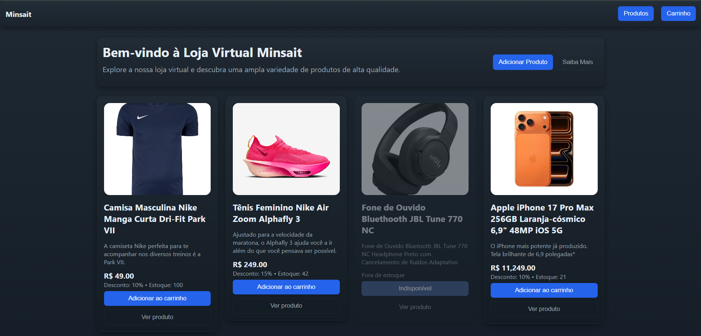

#  Loja Virtual – Protótipo Front-end (Angular)

Este repositório contém um **protótipo de loja virtual desenvolvido em Angular**, criado durante uma **capacitação técnica em Java e Angular**.  
O projeto representa **apenas o front-end**, sem integração com back-end ou banco de dados, tendo como foco **layout, navegação e experiência do usuário**.

---

## 🖥️ Preview

<p align="center">
  
</p>

Interface simulando uma loja virtual com listagem de produtos, cards informativos, controle de estoque (simulado) e ações de carrinho.

> ⚠️ **Observação:**  
> Todas as informações exibidas são **mockadas no front-end**, sem persistência de dados.

---

##  Objetivo do Projeto

- Aplicar conceitos fundamentais de **Angular**
- Desenvolver componentes reutilizáveis
- Simular uma aplicação de **e-commerce**
- Trabalhar layout, responsividade e design
- Consolidar aprendizados adquiridos na capacitação técnica

---

##  Tecnologias Utilizadas

- **Angular**
- **TypeScript**
- **HTML5**
- **CSS3**
- **Angular CLI**

---

## 📂 Estrutura do Projeto (resumida)

```bash
src/
 ├── app/
 │   ├── components/
 │   │   ├── header/
 │   │   ├── product-card/
 │   │   └── ...
 │   ├── models/
 │   ├── services/
 │   └── app.component.*
 ├── assets/
 └── environments/
